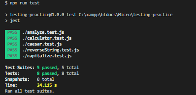

# Testing_practice

<!--
*** Thanks for checking out this README Template. If you have a suggestion that would
*** make this better, please fork the repo and create a pull request or simply open
*** an issue with the tag "enhancement".
*** Thanks again! Now go create something AMAZING! :D
-->

<!-- PROJECT SHIELDS -->
<!--
*** I'm using markdown "reference style" links for readability.
*** Reference links are enclosed in brackets [ ] instead of parentheses ( ).
*** See the bottom of this document for the declaration of the reference variables
*** for contributors-url, forks-url, etc. This is an optional, concise syntax you may use.
*** https://www.markdownguide.org/basic-syntax/#reference-style-links
-->
[![Contributors][contributors-shield]][contributors-url]
[![Forks][forks-shield]][forks-url]
[![Stargazers][stars-shield]][stars-url]
[![Issues][issues-shield]][issues-url]

<!-- PROJECT LOGO -->
 

  

  <h3 align="center">Testing Practice</h3>

  

    This is project was designed to practice about testing in Javascript. 
     
    <a href="https://github.com/adamclasic/testing-practice"><strong>Explore the docs »</strong></a>
     
     
    <a href="https://github.com/adamclasic/testing-practice/issues">Report Bug</a>
    ·
    <a href="https://github.com/adamclasic/testing-practice/issues">Request Feature</a>
  

<!-- TABLE OF CONTENTS -->
## Table of Contents

* [About the Project](#about-the-project)
  * [Built With](#built-with)
* [Contact](#Authors)
* [Acknowledgements](#acknowledgements)
* [How it works](#How-it-works)

<!-- ABOUT THE PROJECT -->
## About The Project

    

This is project was designed to learn about TDD in Javascript. We were asked to build multiple functions and test each function using Jest.

<!-- BUILD WITH -->
## Built With
This project was built using these technologies.
* Javascript
* Jest

<!-- ABOUT THE PROJECT -->
## Prerequisites
* NPM
* Jest

## Getting Started
- To get a local copy up and running follow these simple steps.

#### Clone the repository to run the app.

- $ `git clone git@github.com:adamclasic/testing-practice`
- `cd` into the project directory
- Run `npm install` to install the necessary modules
- Run `npm run tests` to run the written tests

<!-- CONTACT -->
## Authors

👤 **Adam Abderrahmane Allalou**

- Github: [@adamclasic](https://github.com/adamclasic)
- Twitter: [@adamallalou](https://twitter.com/adamallalou)
- Linkedin: [Adam Abderrahmane Allalou](https://linkedin.com/in/adam-allalou)

<!-- ACKNOWLEDGEMENTS -->
## Acknowledgements
* [TheOdinProject](https://www.theodinproject.com/)
* [JestJs](https://jestjs.io/docs/en/getting-started/)

## Show your support

Give a ⭐️ if you like this project!

<!-- MARKDOWN LINKS & IMAGES -->
<!-- https://www.markdownguide.org/basic-syntax/#reference-style-links -->
[contributors-shield]: https://img.shields.io/github/contributors/adamclasic/testing-practice.svg?style=flat-square
[contributors-url]: https://github.com/adamclasic/testing-practice/graphs/contributors
[forks-shield]: https://img.shields.io/github/forks/adamclasic/testing-practice.svg?style=flat-square
[forks-url]: https://github.com/adamclasic/testing-practice/network/members
[stars-shield]: https://img.shields.io/github/stars/adamclasic/testing-practice?style=flat-square
[stars-url]: https://github.com/adamclasic/testing-practice/stargazers
[issues-shield]: https://img.shields.io/github/issues/adamclasic/testing-practice.svg?style=flat-square
[issues-url]: https://github.com/adamclasic/testing-practice/issues

## 📝 License

This project is [MIT](https://opensource.org/licenses/MIT) licensed. 